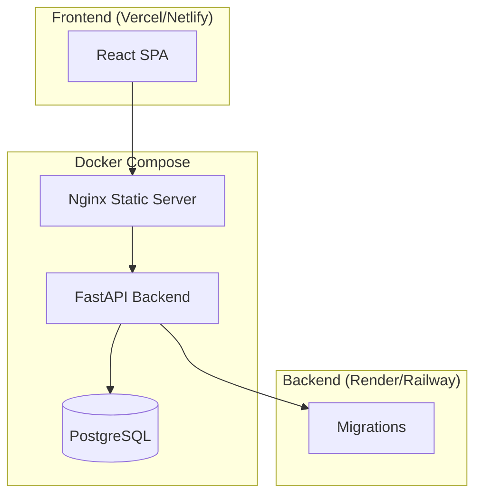

# StockFlow — Inventory & Order Management System

A production-ready full-stack inventory and order management system built with FastAPI, React, PostgreSQL, and Docker.

---

## Architecture



## Tech Stack

| Layer | Technology |
|-------|-----------|
| Frontend | React 18, Vite, React Router, Axios |
| Backend | Python 3.12, FastAPI, SQLAlchemy 2.0, Pydantic v2 |
| Database | PostgreSQL 16 |
| Containerization | Docker, Docker Compose |
| Testing | pytest, pytest-cov |
| CI/CD | Render (backend), Vercel (frontend) |

## Features

- Product management with SKU tracking and inventory control
- Customer management with unique email validation
- Order creation with automatic inventory deduction
- Real-time stock validation preventing overselling
- Low-stock alerts (< 10 units threshold)
- Search and pagination across all entities
- Soft delete support with full data retention
- Professional responsive dashboard UI
- Swagger API documentation at `/docs`
- Health checks and structured logging

## Project Structure

```
stockflow/
├── backend/
│   ├── app/
│   │   ├── api/           # REST API routes
│   │   ├── core/          # Configuration & settings
│   │   ├── database/      # Database session & connection
│   │   ├── models/        # SQLAlchemy ORM models
│   │   ├── schemas/       # Pydantic request/response models
│   │   ├── services/      # Business logic layer
│   │   ├── repositories/  # Data access layer
│   │   ├── utils/         # Logging, exceptions, middleware
│   │   └── main.py        # FastAPI application entry
│   ├── alembic/           # Database migrations
│   ├── tests/             # pytest test suite
│   ├── Dockerfile
│   └── requirements.txt
├── frontend/
│   ├── src/
│   │   ├── api/           # Axios client & API modules
│   │   ├── components/    # Reusable UI components
│   │   ├── context/       # React context state management
│   │   ├── layouts/       # Dashboard layout shell
│   │   ├── pages/         # Route pages
│   │   └── App.jsx        # Root component
│   ├── Dockerfile
│   ├── nginx.conf
│   └── package.json
├── docker-compose.yml
├── .env.example
└── README.md
```

## Quick Start

### Prerequisites

- Python 3.12+
- Node.js 22+
- PostgreSQL 16+
- Docker & Docker Compose (optional)

### Local Development

**1. Clone and set up the backend:**

```bash
cd backend
python -m venv .venv
source .venv/bin/activate
pip install -r requirements.txt
```

**2. Configure environment:**

```bash
cp .env.example .env
# Edit .env with your database credentials
```

**3. Run migrations:**

```bash
alembic upgrade head
```

**4. Start the backend:**

```bash
uvicorn app.main:app --reload --port 8000
```

**5. Set up the frontend (new terminal):**

```bash
cd frontend
cp .env.example .env
npm install
npm run dev
```

The app will be available at `http://localhost:5173` and the API at `http://localhost:8000/docs`.

### Docker Setup

```bash
# From the project root
cp .env.example .env

# Build and start all services
docker compose up --build

# Run migrations
docker compose exec backend alembic upgrade head

# Run tests
docker compose exec backend pytest --cov=app --cov-report=term-missing
```

The app will be available at `http://localhost` and the API docs at `http://localhost/api/v1/docs`.

## API Endpoints

### Products

| Method | Endpoint | Description |
|--------|----------|-------------|
| POST | `/api/v1/products` | Create product |
| GET | `/api/v1/products` | List products (paginated, searchable) |
| GET | `/api/v1/products/low-stock` | List low-stock products |
| GET | `/api/v1/products/{id}` | Get product by ID |
| PUT | `/api/v1/products/{id}` | Update product |
| DELETE | `/api/v1/products/{id}` | Soft-delete product |

### Customers

| Method | Endpoint | Description |
|--------|----------|-------------|
| POST | `/api/v1/customers` | Create customer |
| GET | `/api/v1/customers` | List customers (paginated, searchable) |
| GET | `/api/v1/customers/{id}` | Get customer by ID |
| DELETE | `/api/v1/customers/{id}` | Soft-delete customer |

### Orders

| Method | Endpoint | Description |
|--------|----------|-------------|
| POST | `/api/v1/orders` | Create order (validates stock, deducts inventory) |
| GET | `/api/v1/orders` | List orders (paginated) |
| GET | `/api/v1/orders/{id}` | Get order with items |
| DELETE | `/api/v1/orders/{id}` | Soft-delete order |

### Dashboard

| Method | Endpoint | Description |
|--------|----------|-------------|
| GET | `/api/v1/dashboard/stats` | Aggregate statistics |

### Health

| Method | Endpoint | Description |
|--------|----------|-------------|
| GET | `/health` | Health check |

## Deployment

### Backend (Render)

1. Create a new Web Service on Render
2. Set the build command: `pip install -r requirements.txt`
3. Set the start command: `alembic upgrade head && uvicorn app.main:app --host 0.0.0.0 --port $PORT`
4. Add environment variables from `.env.example`
5. Point the service at the `backend/` directory

### Frontend (Vercel)

1. Connect your repository to Vercel
2. Set the root directory to `frontend/`
3. Build command: `npm run build`
4. Output directory: `dist`
5. Add environment variable `VITE_API_URL` pointing to your deployed backend URL

## Assumptions & Trade-offs

- **Soft delete** is used instead of hard delete to preserve referential integrity and audit trails
- **SQLite** is used for testing to keep the test suite fast and self-contained
- **Server-side pagination** keeps the frontend responsive with large datasets
- **Backend-calculated totals** ensure the server is always the source of truth for financial data
- **Single-order creation via API** keeps the transaction atomic; no partial orders are committed

## Future Improvements

- Authentication & authorization (JWT-based)
- Role-based access control (admin, staff)
- Order status workflow (pending → confirmed → shipped → delivered)
- Stock movement history / audit log
- CSV/PDF export for orders and products
- Email notifications for low-stock alerts
- WebSocket-based real-time inventory updates
- Rate limiting and API key management
- CI/CD pipeline with GitHub Actions

## Screenshots

<!-- Add screenshots here after running the application -->
- Dashboard
- Product Management
- Order Creation Flow
- Order Detail View
- Mobile Responsive View

## License

MIT
